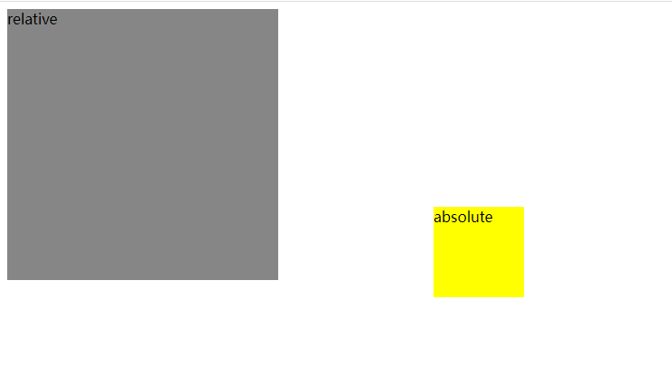
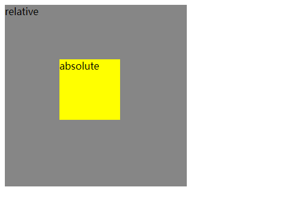

# css

## o

### opacity

```shell
透明度级别
opacity: 0.0 完全透明
opacity: 1.0 完全部透明
```

## p

### position

**position:static**

```shell
默认属性,此时top,right,bottom,left 属性无效
```

**position:relative**

```shell
相对于原位置进行定位, 不脱离文档流, 可以通过z-index进行层次分级
```

**position:absolute**

```shell
脱离文档流的布局,遗留下的空间由后面的元素填充,定位的起始元素为position不为static的父元素(如果没有 父元素为浏览器的左上角),可以通过z-index进行层次分级
```

**position:fixed(固定定位)**

```shell
实现某个元素在可视窗口的居中位置显示或用于导航吸顶
固定定位的盒子必须有宽度,如果没有宽度,那么宽度由内容撑开,没有内容就不能在页面上看到
固定定位的盒子和父级盒子无关,它是以屏幕为主
```


**父相子绝**

1.没有使用relative

```css
<!DOCTYPE html>
<html lang="en">
<head>
    <meta charset="UTF-8">
    <meta http-equiv="X-UA-Compatible" content="IE=edge">
    <meta name="viewport" content="width=device-width, initial-scale=1.0">
    <title>Document</title>
    <style>
        .relative {
            background-color: #868686;
            width: 300px;
            height: 300px;
        }
        .absolute {
            background-color: yellow;
            width: 100px;
            height: 100px;
            position: absolute;
            top: 30%;
            left: 30%;
        }
    </style>
</head>
<body>
    <div class="relative">
        relative
        <div class="absolute">
            absolute
        </div>
    </div>
</body>
</html>
```



2.使用relative

```css
<!DOCTYPE html>
<html lang="en">
<head>
    <meta charset="UTF-8">
    <meta http-equiv="X-UA-Compatible" content="IE=edge">
    <meta name="viewport" content="width=device-width, initial-scale=1.0">
    <title>Document</title>
    <style>
        .relative {
            background-color: #868686;
            width: 300px;
            height: 300px;
            position: relative;
        }
        .absolute {
            background-color: yellow;
            width: 100px;
            height: 100px;
            position: absolute;
            top: 30%;
            left: 30%;
        }
    </style>
</head>
<body>
    <div class="relative">
        relative
        <div class="absolute">
            absolute
        </div>
    </div>
</body>
</html>
```



## t

### transition

```shell
vue中过渡动画(类名实现方式)
vue中的过渡动画分为两类,一类是进场动画，一类是出场动画
实现动画主要由三种方式 类名,css动画库,js函数
类名:本质就是动态添加类名实现动画
- 在进入/离开的过渡中,会有6个class切换
	1.v-enter: 定义进入过渡的开始状态,在元素被插入之前生效,在元素被插入之后的下一帧移除
			  # 进入时的初始状态
	2.v-enter-active: 定义进入过渡生效时的状态,在整个进入过渡的阶段中应用,在元素被插入前生效,在过渡/动画完成后移除,这个类可以用来定义进入过渡的过程时间,延迟和曲线函数
			  # 进入过渡生效的状态
	3.v-enter-to: 2.1.8版本以上,定义进入过渡的结束状态,在元素被插入之后的下一帧生效(于此同时v-enter被移除),在过渡/动画完成后移除
			  # 进入过渡结束状态 
	4.v-leave: 定义离开过渡的开始状态,在离开过渡被触发时立刻生效,下一帧被移除
	    	   # 离开时的开始状态
	5.v-leave-active: 定义离开过渡生效时的状态,在整个离开过渡的阶段中应用,在离开过渡被触发时立刻生效,在过渡/动画完成之后移除,这个类可以被用来定义离开过渡的过程时间,延迟和曲线函数
	 		   # 离开过渡生效时的状态 
	6.v-leave-to: 2.1.8版本以上 定义离开过渡的结束状态,在离开过渡被触发之后的下一帧生效(此时 v-leave被删除) 在过渡/动画完成之后移除
			   # 离开时的初始状态 
	
	找到需要添加过渡元素的动画,用一个transition标签包裹起来,并给他指定一个name属性,这个name属性将会替换调类名的v-前缀
```


# js

