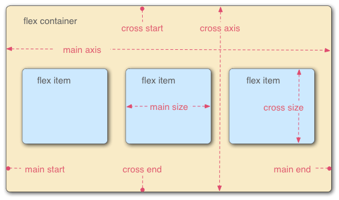
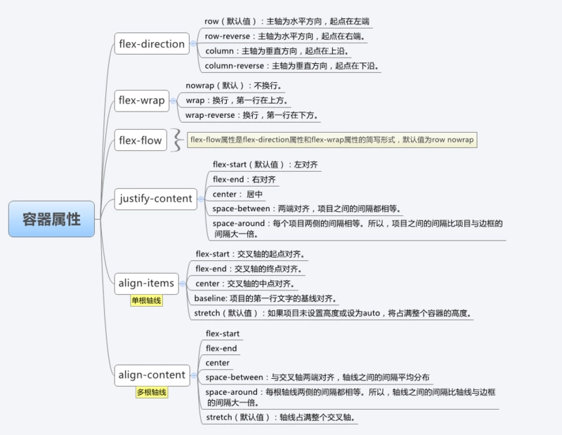
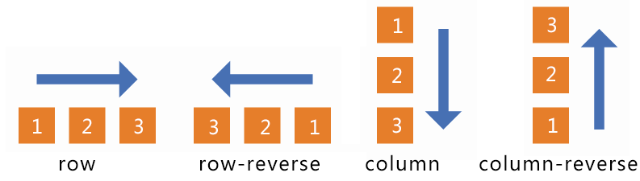
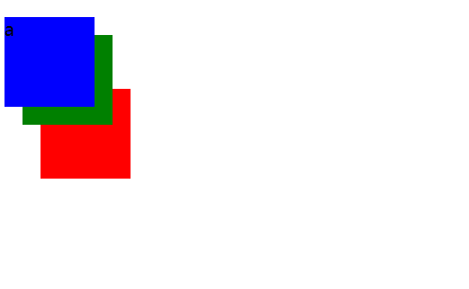
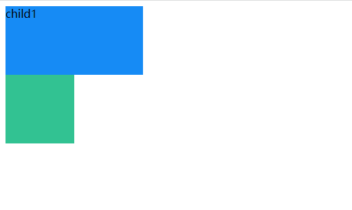
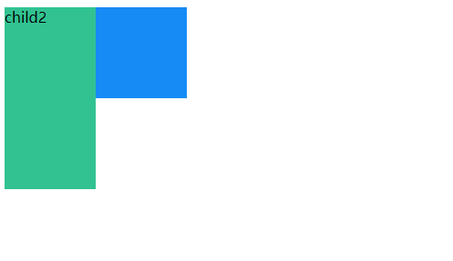

# css

## f

### flex

Flex 布局的主要思想是使父容器能够调节子元素的宽度/高度（和排列顺序），从而能够最好地填充可用空间（**主要是为了适应所有类型的显示设备和屏幕尺寸**）。flex布容器能够放大子元素使之尽可能填充可用空间，也可以收缩子元素使之不溢出。

设为Flex布局以后，子元素的float、clear和vertical-align属性将失效。

**基本概念**

采用 Flex 布局的元素，称为 Flex 容器（flex container），简称"容器"。它的所有子元素自动成为容器成员，称为 Flex 项目（flex item），简称"项目"。


##                            

**容器属性**

​                      

```shell
容器使用实例
<head>
    <meta charset="UTF-8">
    <meta http-equiv="X-UA-Compatible" content="IE=edge">
    <meta name="viewport" content="width=device-width, initial-scale=1.0">
    <title>Document</title>
    <style>
        .father {
            display: flex;
            flex-flow: wrap;
            justify-content: space-between;
        }
        .son {
            width: 200px;
            height: 200px;
            border: 1px solid red;
            background-color: yellow;
        }
    </style>
</head>
<body>
    <div class="father">
        <div class="son">1</div>
        <div class="son">2</div>
        <div class="son">3</div>
        <div class="son" style="flex-grow: 3;">4</div>
        <div class="son">5</div>
        <div class="son">6</div>
        <div class="son">7</div>
        <div class="son">8</div>
    </div>
</body>
```


2.1 flex-direction

- row（默认值）：主轴为水平方向，起点在左端。
- row-reverse：主轴为水平方向，起点在右端。
- column：主轴为垂直方向，起点在上沿。
- column-reverse：主轴为垂直方向，起点在下沿。



2.2 flex-wrap

- nowrap（默认）：不换行。
- wrap：换行，第一行在上方。
- wrap-reverse：换行，第一行在下方。

2.3 flex-flow

​      flex-direction和flex-wrap的简写 默认row,nowrap

2.4  justify-content

- flex-start（默认值）：左对齐
- flex-end : 右对齐
- center : 居中
- space-between: 两端对齐,项目之间的间隔都相等
- space-around: 每个项目两侧的间隔相等,所以,项目之间的间隔比项目与边框的间隔大一倍


2.5 align-items

- flex-start: 交叉轴的起点对齐
- flex-end: 交叉轴的终点对齐
- center: 交叉轴的中点对齐
- baseline: 项目的第一行文字的基线对齐
- stretch(默认值): 如果项目未设置高度或设为auto,将占满整个容器的高度


2.6 align-content

  定义了多根轴线的对齐方式, 如果项目只有一根轴线,那么该属性将不起作用

- flex-start: 与交叉轴的起点对齐
- flex-end: 与交叉轴的终点对齐
- center: 与交叉轴的中点对齐
- space-between：与交叉轴两端对齐，轴线之间的间隔平均分布。
- space-around：每根轴线两侧的间隔都相等。所以，轴线之间的间隔比轴线与边框的间隔大一倍。
- stretch（默认值）：轴线占满整个交叉轴。


**项目属性**


3.1 order属性


3.2 flex-grow

flex-grow 属性定义项目的放大比例,默认为0,即如果存在剩余空间,也不放大

如果所有项目的`flex-grow`属性都为1，则它们将等分剩余空间（如果有的话）。如果一个项目的`flex-grow`属性为2，其他项目都为1，则前者占据的剩余空间将比其他项多一倍。


3.3 flex-shrink 

`flex-shrink`属性定义了项目的缩小比例，默认为1，即如果空间不足，该项目将缩小。


如果所有项目的`flex-shrink`属性都为1，当空间不足时，都将等比例缩小。如果一个项目的`flex-shrink`属性为0，其他项目都为1，则空间不足时，前者不缩小。

负值对该属性无效。

3.4 align-self

`align-self`属性允许单个项目有与其他项目不一样的对齐方式，可覆盖`align-items`属性。默认值为`auto`，表示继承父元素的`align-items`属性，如果没有父元素，则等同于`stretch`。

```shell
.item {
  align-self: auto | flex-start | flex-end | center | baseline | stretch;
}
```


### opacity

```shell
透明度级别
opacity: 0.0 完全透明
opacity: 1.0 完全部透明
```

## p

### position

**position:static**

```shell
默认属性,此时top,right,bottom,left 属性无效
```

**position:relative**

```shell
相对于原位置进行定位, 不脱离文档流, 可以通过z-index进行层次分级
```

**position:absolute**

```shell
脱离文档流的布局,遗留下的空间由后面的元素填充,定位的起始元素为position不为static的父元素(如果没有 父元素为浏览器的左上角),可以通过z-index进行层次分级
```

**position:fixed(固定定位)**

```shell
实现某个元素在可视窗口的居中位置显示或用于导航吸顶
固定定位的盒子必须有宽度,如果没有宽度,那么宽度由内容撑开,没有内容就不能在页面上看到
固定定位的盒子和父级盒子无关,它是以屏幕为主
```


**父相子绝**

1.没有使用relative

```css
<!DOCTYPE html>
<html lang="en">
<head>
    <meta charset="UTF-8">
    <meta http-equiv="X-UA-Compatible" content="IE=edge">
    <meta name="viewport" content="width=device-width, initial-scale=1.0">
    <title>Document</title>
    <style>
        .relative {
            background-color: #868686;
            width: 300px;
            height: 300px;
        }
        .absolute {
            background-color: yellow;
            width: 100px;
            height: 100px;
            position: absolute;
            top: 30%;
            left: 30%;
        }
    </style>
</head>
<body>
    <div class="relative">
        relative
        <div class="absolute">
            absolute
        </div>
    </div>
</body>
</html>
```


2.使用relative

```css
<!DOCTYPE html>
<html lang="en">
<head>
    <meta charset="UTF-8">
    <meta http-equiv="X-UA-Compatible" content="IE=edge">
    <meta name="viewport" content="width=device-width, initial-scale=1.0">
    <title>Document</title>
    <style>
        .relative {
            background-color: #868686;
            width: 300px;
            height: 300px;
            position: relative;
        }
        .absolute {
            background-color: yellow;
            width: 100px;
            height: 100px;
            position: absolute;
            top: 30%;
            left: 30%;
        }
    </style>
</head>
<body>
    <div class="relative">
        relative
        <div class="absolute">
            absolute
        </div>
    </div>
</body>
</html>
```


## t

### text-overflow

```shell
clip     不显示省略标记(...),只是简单的裁剪
ellipsis 当文本溢出时显示省略标记(...)
使用时需要配合 overflow:hidden;white-space:nowrap使用

例:
text-overflow: ellipsis
overflow:hidden
white-space:nowrap
必要的宽度限制
```


### transform

```shell
transform:translate
例:
	transform:translateX(20px) 向右平移20px
	transform:translateX(50%，50%)  相对原来的位置,移动各自宽度和高度的50% 
参考自己的位置进行平移
```


### transition

```shell
vue中过渡动画(类名实现方式)
vue中的过渡动画分为两类,一类是进场动画，一类是出场动画
实现动画主要由三种方式 类名,css动画库,js函数
类名:本质就是动态添加类名实现动画
- 在进入/离开的过渡中,会有6个class切换
	1.v-enter: 定义进入过渡的开始状态,在元素被插入之前生效,在元素被插入之后的下一帧移除
			  # 进入时的初始状态
	2.v-enter-active: 定义进入过渡生效时的状态,在整个进入过渡的阶段中应用,在元素被插入前生效,在过渡/动画完成后移除,这个类可以用来定义进入过渡的过程时间,延迟和曲线函数
			  # 进入过渡生效的状态
	3.v-enter-to: 2.1.8版本以上,定义进入过渡的结束状态,在元素被插入之后的下一帧生效(于此同时v-enter被移除),在过渡/动画完成后移除
			  # 进入过渡结束状态 
	4.v-leave: 定义离开过渡的开始状态,在离开过渡被触发时立刻生效,下一帧被移除
	    	   # 离开时的开始状态
	5.v-leave-active: 定义离开过渡生效时的状态,在整个离开过渡的阶段中应用,在离开过渡被触发时立刻生效,在过渡/动画完成之后移除,这个类可以被用来定义离开过渡的过程时间,延迟和曲线函数
	 		   # 离开过渡生效时的状态 
	6.v-leave-to: 2.1.8版本以上 定义离开过渡的结束状态,在离开过渡被触发之后的下一帧生效(此时 v-leave被删除) 在过渡/动画完成之后移除
			   # 离开时的初始状态 
	
	找到需要添加过渡元素的动画,用一个transition标签包裹起来,并给他指定一个name属性,这个name属性将会替换调类名的v-前缀
```

## v

### vh,vw

```shell
vh是一种视窗单位,也是相对单位,相对于视窗的高度,视窗被均分为100单位的vh
1vh等于视窗高度的1%
1vw等于视窗宽度的1%
```

## w

### white-space

```shell
white-space: pre-line
合并空白符序列,保留换行符,多个空格会被浏览器看做一个空格来处理,如果有换行符(回车键),换行符后的内容会从下一行开始,不影响自动换行
```


## z

### z-index

```shell
z-index 设置元素的堆叠顺序,拥有更高堆叠顺序的元素总是处于堆叠元素顺序较低的前面
# 层级关系的比较
1,对于同级元素,默认(position:static)情况下文档流后面的元素会覆盖前面的
2,对于同级元素,position不为static且z-index存在的情况下 z-index大的元素会覆盖z-index小的元素,z-index越大优先级越高
3,position不为static 且z-index不存在时,z-index为auto
4,z-index为auto的元素不参与层级关系的比较

z-index属性并不是在任何元素上都有效果,它仅在定位元素(position非static)上有效果
判断元素在z轴的堆叠顺序,不仅仅是比较两个元素的z-index的大小,堆叠顺序实际由元素的层叠上下文,层叠等级共同决定
```

**层叠上下文**

```shell
如果一个元素含有层叠上下文,可以理解这个元素就高人一等,最终表现为离屏幕更近
```

**层叠等级**

```shell
普通元素的层叠等级优先由其所在的层叠上下文决定
层叠等级的比较只有在当前的层叠上下文元素中才有意义
```

**如何产生层叠上下文**

```shell
html的根元素<html></html>本身就具有层叠上下文,称为根层叠上下文
普通元素设置position属性为非static并设置z-index为具体数值,产生层叠上下文
```

**例1**

```css
<!DOCTYPE html>
<html lang="en">
<head>
    <meta charset="UTF-8">
    <meta http-equiv="X-UA-Compatible" content="IE=edge">
    <meta name="viewport" content="width=device-width, initial-scale=1.0">
    <title>Document</title>
    <style>
        div {
            position: relative;
            width: 100px;
            height: 100px;
        }
        p {
            position: absolute;
            font-size: 20px;
            width: 100px;
            height: 100px;
        }
        .a {
            background-color: blue;
            z-index: 3;
        }
        .b {
            background-color: green;
            top: 20px;
            left: 20px;
            z-index: 2;
        }
        .c {
            background-color: red;
            left: 40px;
            top: -20px;
            z-index: 1;
        }
    </style>
</head>
<body>
    <div>
        <p class="a">a</p>
        <p class="b">b</p>
    </div>
    <div>
        <p class="c">c</p>
    </div>
</body>
</html>
```



```shell
因为p.a、p.b、p.c三个的父元素div都没有设置z-index，所以不会产生层叠上下文,所以.a、.b、.c都处于由<html></html>标签产生的“根层叠上下文”中，属于同一个层叠上下文此时谁的z-index值大，谁在上面。
```

**例2**

```css
<!DOCTYPE html>
<html lang="en">
<head>
    <meta charset="UTF-8">
    <meta http-equiv="X-UA-Compatible" content="IE=edge">
    <meta name="viewport" content="width=device-width, initial-scale=1.0">
    <title>Document</title>
    <style>
         div {
            width: 100px;
            height: 100px;
            position: relative;
        }
        .box1 {
            z-index: 2;
        }
        .box2 {
            z-index: 1;
        }
        p {
            position: absolute;
            font-size: 20px;
            width: 100px;
            height: 100px;
        }
        .a {
            background-color: blue;
            z-index: 100;
        }
        .b {
            background-color: green;
            top: 20px;
            left: 20px;
            z-index: 200;
        }
        .c {
            background-color: red;
            top: -20px;
            left: 40px;
            z-index: 9999;
        }
    </style>
</head>
<body>
    <div class="box1">
        <p class="a">a</p>
        <p class="b">b</p>
      </div>
    
      <div class="box2">
        <p class="c">c</p>
      </div>
</body>
</html>
```

```shell
虽然p.c元素的z-index值为9999，远大于p.a和p.b的z-index值，但是由于p.a、p.b的父元素div.box1产生的层叠上下文的z-index的值为2，p.c的父元素div.box2所产生的层叠上下文的z-index值为1，所以p.c永远在p.a和p.b下面。
同时，如果我们只更改p.a和p.b的z-index值，由于这两个元素都在父元素div.box1产生的层叠上下文中，所以，谁的z-index值大，谁在上面。
```

**层叠顺序及套路**


```shell
1.首先先看要比较的两个元素是否处于同一个层叠上下文中
  1.1 谁的层叠等级大，谁在上面(判断层叠等级大小,通过层叠顺序图)
  1.2 如果两个元素不在同一层叠上下文中，先比较他们所处的层叠上下文的层叠等级
2.当两个元素层叠等级相同、层叠顺序相同时，在DOM结构中后面的元素层叠等级在前面元素之上。
```

**练习1**

```css
<!DOCTYPE html>
<html lang="en">
<head>
    <meta charset="UTF-8">
    <meta http-equiv="X-UA-Compatible" content="IE=edge">
    <meta name="viewport" content="width=device-width, initial-scale=1.0">
    <title>Document</title>
    <style>
        .box1, .box2 {
            position: relative;
        }
        .child1 {
            width: 200px;
            height: 100px;
            background: #168bf5;
            position: absolute;
            top: 0;
            left: 0;
            z-index: 2;
        }
        .child2 {
            width: 100px;
            height: 200px;
            background: #32c292;
            position: absolute;
            top: 0;
            left: 0;
            z-index: 1;
        }
    </style>
</head>
<body>
    <div class="box1">
        <div class="child1">child1</div>
      </div>
    
    <div class="box2">
        <div class="child2"></div>
    </div>
</body>
</html>
```



```shell
.box1/.box2虽然设置了position: relative，但是在未设置z-index的情况下，这两个div还是普通元素，并没有产生层叠上下文。所以，child1/.child2属于<html></html>元素的“根层叠上下文”中，此时，谁的z-index值大，谁在上面。
```

**练习2**

```css
<!DOCTYPE html>
<html lang="en">
<head>
    <meta charset="UTF-8">
    <meta http-equiv="X-UA-Compatible" content="IE=edge">
    <meta name="viewport" content="width=device-width, initial-scale=1.0">
    <title>Document</title>
    <style>
        .box1, .box2 {
            position: relative;
            z-index: 0;
        }
        .child1 {
            width: 200px;
            height: 100px;
            background: #168bf5;
            position: absolute;
            top: 0;
            left: 0;
            z-index: 2;
        }
        .child2 {
            width: 100px;
            height: 200px;
            background: #32c292;
            position: absolute;
            top: 0;
            left: 0;
            z-index: 1;
        }
    </style>
</head>
<body>
    <div class="box1">
        <div class="child1">child1</div>
      </div>
    
    <div class="box2">
        <div class="child2">child2</div>
    </div>
</body>
</html>
```



```shell
 此时，我们发现，仅仅修改了.box1/.box2的z-index属性值改为数值0，最终结果完全相反。这时.child2覆盖在了.child1上面。原因是什么呢？很简单：因为设置z-index: 0后，.box1/.box2产生了各自的层叠上下文，这时候要比较.child1/.child2的层叠关系完全由父元素.box1/.box2的层叠关系决定。但是.box1/.box2的z-index值都为0，都是块级元素（所以它们的层叠等级，层叠顺序是相同的），这种情况下，在DOM结构中后面的覆盖前面的，所以.child2就在上面。
```

**属性对层叠山下文的影响**

```shell
1.父元素的display属性值为flex|inline-flex,子元素z-index属性不为auto的时候,子元素为层叠上下文元素
2.元素的opacity属性值不是1
3.元素的transform属性值不是none
```

# js

### Json

**JSON.parse**

```shell
JSON 通常用于与服务端交换数据。
在接收服务器数据时一般是字符串。
我们可以使用 JSON.parse() 方法将数据转换为 JavaScript 对象。
 var obj = JSON.parse('{ "name":"runoob", "alexa":10000, "site":"www.runoob.com" }');
 console.log('obj', obj, typeof obj)
 # obj {name: 'runoob', alexa: 10000, site: 'www.runoob.com'} object
```


**JSON.stringify**

```shell
JSON 的常规用途是同 web 服务器进行数据交换。
在向 web 服务器发送数据时，数据必须是字符串。
通过 JSON.stringify() 把 JavaScript 对象转换为字符串。

 var obj = { name:"Bill Gates", age:62, city:"Seattle"};
 var res = JSON.stringify(obj)
 console.log(obj, 'res', res, typeof res)
 # {name: 'Bill Gates', age: 62, city: 'Seattle'}
   'res'
   '{"name":"Bill Gates","age":62,"city":"Seattle"}'
   'string'
```

### Object.assign

**基本用法**

```shell
# Object.assign方法用于对象的合并，将源对象（source）的所有可枚举属性，复制到目标对象（target）。
const target = { a: 1 };
const source1 = { b: 2 };
const source2 = { c: 3 };
Object.assign方法的第一个参数是目标对象，后面的参数都是源对象。

# 注意，如果目标对象与源对象有同名属性，或多个源对象有同名属性，则后面的属性会覆盖前面的属性。
const target = { a: 1, b: 1 };

const source1 = { b: 2, c: 2 };
const source2 = { c: 3 };
Object.assign(target, source1, source2);
target // {a:1, b:2, c:3}
# 如果只有一个参数，Object.assign会直接返回该参数。
const obj = {a: 1};
Object.assign(obj) === obj // true
# 如果该参数不是对象，则会先转成对象，然后返回。
typeof Object.assign(2) // "object"
# 由于undefined和null无法转成对象，所以如果它们作为参数，就会报错。
Object.assign(undefined) // 报错
Object.assign(null) // 报错
# 如果非对象参数出现在源对象的位置（即非首参数），那么处理规则有所不同。首先，这些参数都会转成对象，如果无法转成对象，就会跳过。这意味着，如果undefined和null不在首参数，就不会报错。
let obj = {a: 1};
Object.assign(obj, undefined) === obj // true
Object.assign(obj, null) === obj // true
```

**注意点**

```shell
# 同名属性的替换
对于这种嵌套的对象，一旦遇到同名属性，Object.assign的处理方法是替换，而不是添加。
const target = { a: { b: 'c', d: 'e' } }
const source = { a: { b: 'hello' } }
Object.assign(target, source)
// { a: { b: 'hello' } }
上面代码中，target对象的a属性被source对象的a属性整个替换掉了，而不会得到{ a: { b: 'hello', d: 'e' } }的结果。这通常不是开发者想要的，需要特别小心。

一些函数库提供 Object.assign的定制版本（比如 Lodash 的_.defaultsDeep方法），可以得到深拷贝的合并。
# 数组的处理
Object.assign可以用来处理数组，但是会把数组视为对象。
Object.assign([1, 2, 3], [4, 5])
// [4, 5, 3]
上面代码中，Object.assign把数组视为属性名为 0、1、2 的对象，因此源数组的 0 号属性4覆盖了目标数组的 0 号属性1。
```

**常见用途**

```shell
# 为对象添加属性
class Point {
  constructor(x, y) {
    Object.assign(this, {x, y});
  }
}
上面方法通过Object.assign方法，将x属性和y属性添加到Point类的对象实例。
# 为对象添加方法
Object.assign(SomeClass.prototype, {
  someMethod(arg1, arg2) {
    ···
  },
  anotherMethod() {
    ···
  }
});

// 等同于下面的写法
SomeClass.prototype.someMethod = function (arg1, arg2) {
  ···
};
SomeClass.prototype.anotherMethod = function () {
  ···
};
上面代码使用了对象属性的简洁表示法，直接将两个函数放在大括号中，再使用assign方法添加到SomeClass.prototype之中。
# 合并多个对象
```

